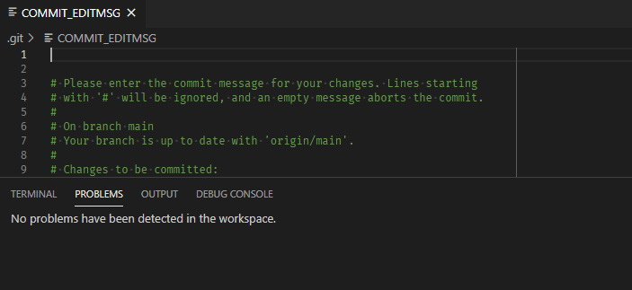

# vscode-commitlint

A VS Code extension that integrates [commitlint](https://github.com/conventional-changelog/commitlint) into [VS Code's commit editor](https://code.visualstudio.com/docs/editor/versioncontrol#_vs-code-as-git-editor).

**[Install from the Visual Studio Marketplace](https://marketplace.visualstudio.com/items?itemName=joshbolduc.commitlint)**



## Features

- Runs commitlint against your commit message as you write it
- Reports lint [errors and warnings in the editor](https://code.visualstudio.com/docs/editor/editingevolved#_errors-warnings)
- Highlights relevant parts of the commit based on the specific issue
- Auto detects commitlint configuration by default
- Supports [all commitlint rules](https://commitlint.js.org/#/reference-rules?id=available-rules)
- Adds autocomplete support to `package.json` and `.commitlintrc.json` based on the [configuration schema](https://json.schemastore.org/commitlintrc.json)

## Requirements

This extension assumes you use [VS Code as your Git editor](https://code.visualstudio.com/docs/editor/versioncontrol#_vs-code-as-git-editor) and have [configured commitlint in your project](https://commitlint.js.org/#/?id=getting-started).

## Settings

### `commitlint.config.file`

Path to a custom commitlint configuration file. Relative paths are resolved based on the workspace root. Leave blank to auto-detect.

### `commitlint.config.extend.rules`

Commitlint rules which will be extended.

**Example configuration as JSON syntax:**

```json
"commitlint.config.extend.rules": {
  "body-leading-blank": [1, "always"],
  "body-max-line-length": [2, "always", 100],
  "footer-leading-blank": [1, "always"],
  "footer-max-line-length": [2, "always", 100],
  "header-max-length": [2, "always", 50],
  "scope-case": [2, "always", "lower-case"],
  "subject-case": [2, "never", ["sentence-case", "start-case", "pascal-case", "upper-case"]],
  "subject-empty": [2, "never"],
  "subject-full-stop": [2, "never", "."],
  "type-case": [2, "always", "lower-case"],
  "type-empty": [2, "never"],
  "type-enum": [
    2,
    "always",
    ["feat", "fix", "docs", "perf", "refactor", "build", "ci", "revert", "style", "test", "chore"]
  ]
}
```

### `commitlint.log.enabled`

Whether to enable logging to the output panel.

### `commitlint.preferBundledLibraries`

Whether to prefer using commitlint libraries bundled with the extension over locally installed versions.
